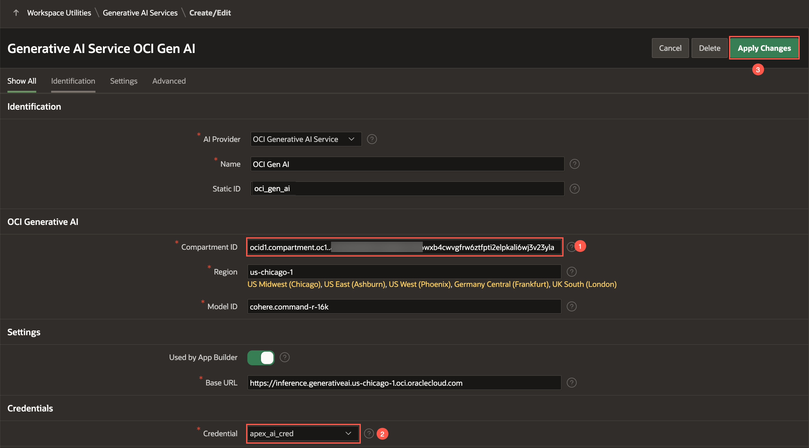

# Introdução

## Sobre este Workshop

Desde a síntese de dados complexos até a criação de respostas contextuais, a IA Generativa está à frente de uma mudança tecnológica, prometendo redefinir como navegamos e utilizamos conhecimento em nossas interações diárias. Com a introdução do desenvolvimento assistido por IA no Oracle APEX, habilitar suas aplicações com recursos de IA generativa nunca foi tão fácil.

Neste workshop, você aprenderá a trazer recursos de IA generativa baseados em grandes modelos de linguagem (LLMs) para suas aplicações construídas com Oracle APEX, sua plataforma low-code favorita. O serviço de IA Generativa pode ser acessado por meio de APIs REST, e ao usar os poderosos recursos de REST Data Source do APEX, você pode incorporar essa tecnologia avançada em suas aplicações de maneira simples e de baixa codificação.

<!-- ## O que é o serviço de IA Generativa da OCI?

[Oracle Cloud Infrastructure Generative AI](https://www.oracle.com/artificial-intelligence/generative-ai/large-language-models/) é um serviço totalmente gerenciado que fornece um conjunto de modelos de linguagem de última geração e personalizáveis que cobrem uma ampla variedade de casos de uso para geração de texto. A IA Generativa atualmente suporta os seguintes modelos fundamentais pré-treinados disponíveis da Meta e Cohere:

| Modelo           | Descrição                                                                                             | Principais Características                            | Idiomas Suportados |
|------------------|-------------------------------------------------------------------------------------------------------|-------------------------------------------------------|---------------------|
| **Cohere Command R**   | Modelo otimizado para aplicações de **retrieval-augmented generation (RAG)**.                     | Alta eficiência, baixa latência, janela de contexto maior | 10 idiomas          |
| **Cohere Command R+**  | Versão aprimorada do Command R para **casos de uso especializados** como geração de conteúdo longo. | Gera respostas contextuais e detalhadas                | 10 idiomas          |
| **Cohere Embed**       | Modelos de embeddings para **converter texto em representações vetoriais**.                     | Versões “Light” são menores e mais rápidas            | Inglês e Multilíngue |
| **Meta Llama 3.1**     | Modelos open source de última geração com **alto desempenho e diversidade de respostas**.        | Janela de contexto de 128K e suporte para 8 idiomas   | 8 idiomas           |
| **Meta Llama 3.2 90B**     | Modelos open source de última geração com capacidade de análise de texto e imagem.        | Janela de contexto de 128K e suporte para 8 idiomas   |            |
{: title=" "}

Você pode ler mais sobre esses modelos na [documentação](https://docs.oracle.com/en-us/iaas/Content/generative-ai/pretrained-models.htm). -->

Este workshop irá guiá-lo pelo processo de utilizar os modelos de geração dentro do Serviço de IA Generativa para desenvolver um recurso de "Fazer Perguntas" para o aplicativo APEX das Escolas de Ensino Médio de Nova York. Esta funcionalidade permite que os pais façam perguntas sobre instalações, políticas e muito mais, ajudando-os a decidir se uma escola específica é a escolha ideal para seu filho.

Tempo Estimado: 60 minutos

### **Objetivos**

* Implementar Faceted Search para Cards e Map Regions para filtrar e buscar a melhor escola.
* Construir um chatbot conversacional usando IA Generativa para fazer perguntas sobre uma escola.
* Gerar e-mail usando IA Generativa para aplicar para uma escola.

*Nota: Este workshop pressupõe o uso do Oracle APEX 24.1.2 ou superior.*

## Pré-requisitos

- Um workspace APEX 24.1.2. Recomendamos que você se inscreva para um workspace em [apex.oracle.com](https://apex.oracle.com). Consulte o lab [Get Started: Option 3](?lab=1-sign-up-apex#Option3:apexoraclecom) para se inscrever em um novo workspace.

*Nota: Este workshop pressupõe o uso do Oracle APEX 24.1.2. Alguns recursos podem não estar disponíveis em versões anteriores, e as instruções, fluxo e capturas de tela podem diferir se você usar uma versão mais antiga do Oracle APEX.*

## Laboratórios

| Módulo | Tempo Estimado |
| --- | --- |
| [Criando uma aplicação APEX](?lab=1-create-app) | 5 minutos |
| [Configurar as Chaves da API OCI](?lab=3-configure-oci) | 10 minutos |
| [Construir uma Consulta Conversacional usando IA Generativa](?lab=4-using-genai) | 20 minutos |
| [Executar a Aplicação](?lab=6-run-app) | 5 minutos |

Tempo total estimado: 60 minutos

### **Vamos Começar!**

Se o menu não estiver visível, você pode abri-lo clicando no botão de menu () no canto superior esquerdo da página.

## Downloads

Se você tiver algum problema ou o aplicativo não estiver funcionando como esperado, você pode baixar e instalar o aplicativo concluído da seguinte maneira:

1. [Clique aqui](https://c4u04.objectstorage.us-ashburn-1.oci.customer-oci.com/p/EcTjWk2IuZPZeNnD_fYMcgUhdNDIDA6rt9gaFj_WZMiL7VvxPBNMY60837hu5hga/n/c4u04/b/livelabsfiles/o/labfiles/nyc-gen-ai-app.zip) para baixar o arquivo zip do aplicativo concluído.

2. Importe o arquivo **nyc-gen-ai-app.zip** para seu workspace. Para importar o app, vá para **App Builder > Import**.

3. Siga os passos no assistente de Install Application para instalar o app junto com os Supporting Objects.

4. Uma vez que a aplicação esteja instalada, navegue até **App Builder > Workspace Utilities > Web Credentials**.

5. Edite os detalhes de **apex\_ai\_cred** para que correspondam à sua Chave da API OCI. Consulte o lab: [Configure the OCI API Keys](?lab=3-configure-oci) para criar uma Chave da API OCI.

     
6. Navegue até **App Builder > Workspace Utilities > Generative AI**. Edite o serviço **OCI Gen AI**.

    - Insira o **ID do Compartimento**. Consulte a [Documentação](https://docs.oracle.com/en-us/iaas/Content/GSG/Tasks/contactingsupport_topic-Locating_Oracle_Cloud_Infrastructure_IDs.htm#:~:text=Finding%20the%20OCID%20of%20a,displayed%20next%20to%20each%20compartment.) para obter seu ID de Compartimento. Se você tiver apenas um compartimento, use o OCID do arquivo de configuração que você salvou ao criar sua Chave da API OCI.
    - Para Credential, selecione **apex\_ai\_cred**.
    - Clique em **Apply Changes**.
    

7. Pronto. Agora, execute a aplicação e veja-a em ação! Siga o lab: [Run the Application](?lab=6-run-app) para rodar o app.

## Saiba Mais - *Links Úteis*

- [OCI Generative AI](https://www.oracle.com/artificial-intelligence/generative-ai/large-language-models/)
- [APEX on Autonomous](https://apex.oracle.com/autonomous)
- [APEX Collateral](https://www.oracle.com/database/technologies/appdev/apex/collateral.html)
- [Tutoriais](https://apex.oracle.com/en/learn/tutorials)
- [Comunidade](https://apex.oracle.com/community)
- [Site Externo + Slack](http://apex.world)

## Agradecimentos

 - **Autores** - Toufiq Mohammed, Senior Product Manager; Apoorva Srinivas, Senior Product Manager
 - **Última Atualização Por/Data** - Apoorva Srinivas, Senior Product Manager, julho de 2024