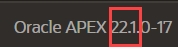
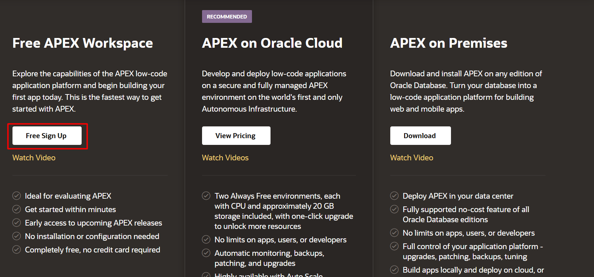

# Inscrever-se em um APEX Workspace

## Introdução

Oracle APEX é uma plataforma de desenvolvimento de aplicativos de **low-code** para o **Oracle Database**. Os serviços **Oracle Application Development (APEX Service)**, **Autonomous Data Warehouse (ADW)**, **Autonomous Transaction Processing (ATP)** e **Autonomous JSON Database** são serviços totalmente gerenciados, pré-integrados e pré-configurados com o APEX, permitindo criar e implantar rapidamente aplicativos modernos orientados por dados na **Oracle Cloud**. Usuários corporativos, desenvolvedores cidadãos e desenvolvedores de aplicativos podem criar aplicativos empresariais 20 vezes mais rápido com 100 vezes menos código — sem precisar aprender tecnologias web complexas, utilizando apenas um navegador.

Se você já possui um **APEX 24.1 Workspace** provisionado, pode pular este laboratório.

**Tempo Estimado:** 5 minutos

## Sobre o Oracle APEX

### *O que é um APEX Workspace?*
Um **APEX Workspace** é um domínio lógico onde você define aplicativos do APEX. Cada workspace está associado a um ou mais esquemas de banco de dados (**database schemas**, usuários do banco de dados), que são utilizados para armazenar objetos de banco de dados, como tabelas, visualizações, pacotes e mais. Aplicativos do APEX são construídos com base nesses objetos de banco de dados.

--- 
 

### *Como descobrir a versão do APEX?*
Para determinar qual versão do Oracle APEX você está utilizando, siga um dos passos abaixo:

- Visualize o número da versão na página inicial do **Workspace**:
    - Faça login no Oracle APEX. A página inicial do **Workspace** será exibida. O número da versão atual aparece no canto inferior direito.

    
    

- Veja a página **About APEX**:
    - Faça login no Oracle APEX. A página inicial do **Workspace** será exibida.
    - Clique no menu **Help** no topo da página e selecione **About**. A página **About APEX** será exibida.

  

---
 

### *Onde realizar o laboratório?*
Você pode realizar este laboratório em qualquer **Oracle Database** com **APEX 24.1.2.1** instalado. Isso inclui o novo **APEX Application Development Service**, o **Oracle Autonomous Database**, o serviço gratuito "apenas para desenvolvimento" **apex.oracle.com**, seu **Oracle Database on-premises** (desde que o APEX 24.1.2 esteja instalado), um provedor de nuvem de terceiros onde o APEX 24.1.2 esteja instalado ou até mesmo em seu laptop, instalando o **Oracle XE** ou **Oracle VirtualBox App Dev VM** e configurando o APEX 24.1.2.

Abaixo estão os passos para se inscrever em um dos seguintes serviços: **APEX Application Development Service**, **Oracle Autonomous Database** ou **apex.oracle.com**.

- O **APEX Application Development Service** é ótimo se você procura uma opção paga flexível que permita concentrar seus esforços no desenvolvimento com o APEX, sem se preocupar com a gestão do banco de dados. Ele oferece 1 OCPU e 1 TB, com possibilidade de expansão conforme necessário.
- A opção **Always Free Oracle Autonomous Database** é ideal para aprender sobre o Oracle Database e APEX. Ela fornece 1 OCPU e 20 GB de armazenamento compactado. Este serviço também pode ser utilizado para aplicativos em produção e pode ser atualizado para um serviço pago, se necessário.
- Por outro lado, o **apex.oracle.com** também é um serviço gratuito; no entanto, ele é designado apenas para fins de desenvolvimento e não permite a execução de aplicativos em produção.

Para realizar os laboratórios deste workshop, qualquer um desses serviços pode ser utilizado.

## Instanciar APEX: apex.oracle.com
Inscrever-se no **apex.oracle.com** é simplesmente uma questão de fornecer os detalhes do **Workspace** que você deseja criar e, em seguida, aguardar o e-mail de aprovação.

1. Acesse [https://apex.oracle.com](https://apex.oracle.com).
2. Clique em **Start for Free Today**.

    

3. Role a página para baixo até ver os detalhes para **apex.oracle.com**. Clique em **Free Sign Up**.

    

4. Na janela de diálogo **Request a Workspace**, insira os seus dados de identificação – Nome, Sobrenome, E-mail e **Workspace**.  
   *Nota: Para o campo workspace, insira um nome exclusivo, como sua inicial e sobrenome.*  

   Clique em **Next**.

   

5. Complete as etapas restantes do assistente.
6. Verifique seu e-mail. Você deverá receber um e-mail do Oracle APEX em alguns minutos.  
   *Nota: Se você não receber o e-mail, volte para a Etapa 3 e certifique-se de que digitou seu e-mail corretamente.*  

   No corpo do e-mail, clique em **Create Workspace**.

   

7. Clique em **Continue to Sign In Screen**.
8. Insira sua senha e clique em **Apply Changes**.
9.  Agora você estará no **APEX Builder**.

   

---

## Resumo

Neste ponto, você já sabe como criar um **APEX Workspace** e está pronto para começar a criar aplicativos incríveis de forma rápida.

Agora você pode **prosseguir para o próximo laboratório**.
