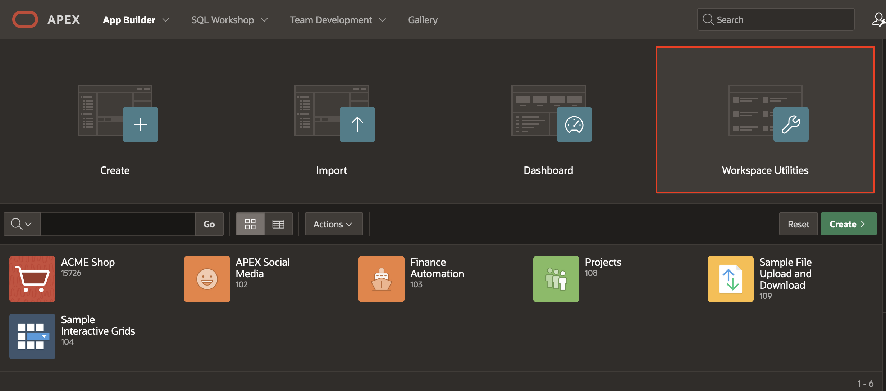

# Configure a Autenticação entre os serviços APEX e Generative AI

## Introdução

Neste workshop, você utilizará o **OCI Generative AI** como provedor de IA para criar um chatbot conversacional. Para usar o **OCI Generative AI Service** no APEX, é necessário configurar as chaves **OCI API Keys**. No **Oracle Cloud Infrastructure (OCI)**, as chaves de API são usadas para autenticação segura ao acessar recursos da OCI por meio de **REST APIs**.

As chaves OCI API consistem em duas partes: uma **Public key** e uma **Private key** e serão disponibilizadas para este laboratório.

**Nota:** O serviço OCI Generative AI está disponível em regiões limitadas. Para verificar se sua região suporta o serviço, consulte a [documentação](https://docs.oracle.com/en-us/iaas/Content/generative-ai/overview.htm#regions).

**Tempo Estimado:** 10 minutos

---

### *Objetivos*

Neste laboratório, você:

- Irá instalar uma **Aplicação** pronta no APEX Workspace
- Criará **Web Credentials** no **Oracle APEX**

---

## Passo 1: Instalar a Aplicação pronta no APEX Workspace

1. [Clique aqui](https://c4u04.objectstorage.us-ashburn-1.oci.customer-oci.com/p/EcTjWk2IuZPZeNnD_fYMcgUhdNDIDA6rt9gaFj_WZMiL7VvxPBNMY60837hu5hga/n/c4u04/b/livelabsfiles/o/labfiles/nyc-gen-ai-app.zip) para baixar o arquivo ZIP do aplicativo concluído.

2. Importe o arquivo **nyc-gen-ai-app.zip** para seu workspace. Para isso, vá para **App Builder > Import**.

3. Siga os passos no assistente **Install Application** para instalar o aplicativo e seus objetos de suporte.

4. Navegue até **App Builder > Workspace Utilities > Generative AI** e edite o serviço **OCI Gen AI**:

    - Insira o **Compartiment ID**. Consulte a [Documentação](https://docs.oracle.com/en-us/iaas/Content/GSG/Tasks/contactingsupport_topic-Locating_Oracle_Cloud_Infrastructure_IDs.htm#:~:text=Finding%20the%20OCID%20of%20a,displayed%20next%20to%20each%20compartment.) para localizar o ID do Compartimento. Se você tiver apenas um compartimento, use o OCID do arquivo de configuração salvo ao criar sua Chave da API OCI.
    - Para Credential, selecione **apex\_ai\_cred**.
    - Clique em **Apply Changes**.

    

---

## Tarefa 2: Criar Web Credentials no Oracle APEX

As **Web Credentials** são usadas para autenticar conexões com serviços REST externos ou serviços **REST Enabled SQL** no APEX.

Criar **Web Credentials** permite armazenar e criptografar as credenciais de autenticação de forma segura para uso em componentes e APIs do Oracle APEX. Essas credenciais não podem ser recuperadas em texto simples e são armazenadas no nível do workspace, ficando visíveis para todos os aplicativos.

Para criar uma **Web Credential** no Oracle APEX:

1. Faça login no seu workspace no **Oracle APEX**.

   

2. Na página inicial do Workspace, clique em **App Builder**.

   

3. Clique em **Workspace Utilities**.

   

4. Selecione **Web Credentials**.

   

5. Clique em **Create**.

   

6. Insira os seguintes detalhes usando o arquivo de configuração copiado na tarefa anterior:

    - **Name**: apex\_ai\_cred  
    - **Authentication Type**: OCI Native Authentication  
    - **OCI User ID**: Insira o OCID do usuário na conta Oracle Cloud. Você pode encontrá-lo na visualização do arquivo de configuração gerado ao criar as chaves de API. O OCID do usuário se parece com: **ocid1.user.oc1..aaaaaaaa\*\*\*\*\*\*wj3v23yla**  
    - **OCI Private Key**: Abra o arquivo de chave privada (.pem) baixado na tarefa anterior. Copie e cole a chave privada.  
        
    - **OCI Tenancy ID**: Insira o OCID do tenancy. O ID do tenancy se parece com: **ocid1.tenancy.oc1..aaaaaaaaf7ush\*\*\*\*cxx3qka**  
    - **OCI Public Key Fingerprint**: Insira o ID do Fingerprint. O Fingerprint se parece com: **a8:8e:c2:8b:fe:\*\*\*\*:ff:4d:40**

   

7. Clique em **Create**.

---

## Resumo

Agora você sabe como criar **Web Credentials** no Oracle APEX e pode **prosseguir para o próximo laboratório**.
